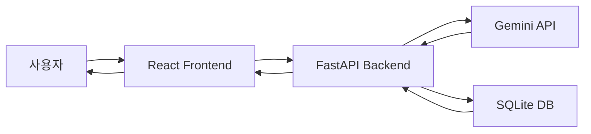
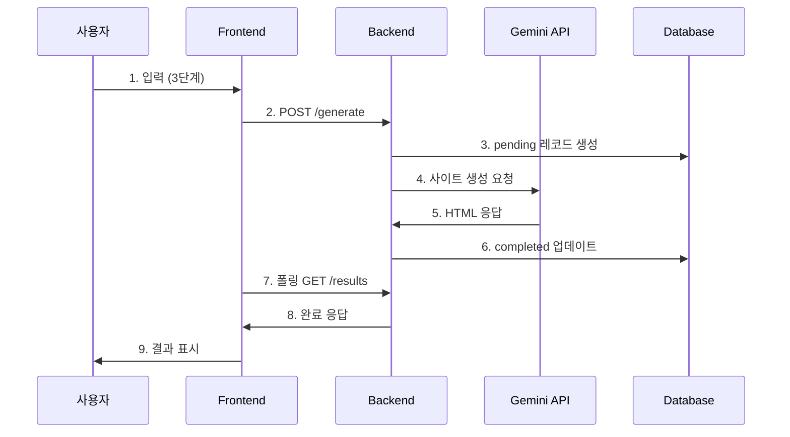

# 쇼핑몰 사이트 생성기 - 기술 문서

## 📋 프로젝트 개요

AI를 활용하여 사용자 입력(상품명, 디자인 스타일, 레퍼런스 URL)을 기반으로 완전한 반응형 쇼핑몰 웹사이트를 자동 생성하는 SPA(Single Page Application)

**버전**: v1.3.1  
**개발 기간**: 2025년 12월  
**언어**: 한국어

---

## 🏗️ 시스템 아키텍처



### 기술 스택

**Frontend**
- React 19.2.0
- TypeScript 5.9.3
- React Router DOM 7.9.6
- Lucide React (아이콘)
- Vite 7.2.6 (빌드 도구)

**Backend**
- Python 3.11+
- FastAPI
- SQLite (데이터베이스)
- Google Generative AI (Gemini API)
- Uvicorn (ASGI 서버)

**이미지 서비스**
- Lorem Flickr (https://loremflickr.com)

---

## 📂 프로젝트 구조

```
generating/
├── frontend/                 # React 프론트엔드
│   ├── src/
│   │   ├── components/      # 재사용 컴포넌트
│   │   │   └── Layout.tsx   # 기본 레이아웃
│   │   ├── pages/           # 페이지 컴포넌트
│   │   │   ├── InputPage.tsx        # 3단계 입력 페이지
│   │   │   ├── GeneratingPage.tsx   # 생성 진행 페이지
│   │   │   ├── ResultPage.tsx       # 결과 표시 페이지
│   │   │   └── GalleryPage.tsx      # 갤러리 페이지
│   │   ├── App.tsx          # 라우팅 설정
│   │   ├── main.tsx         # 진입점
│   │   └── index.css        # 글로벌 스타일
│   └── package.json
│
├── backend/                 # FastAPI 백엔드
│   ├── services/
│   │   └── gemini_service.py    # Gemini API 통합
│   ├── main.py              # FastAPI 앱 및 엔드포인트
│   ├── database.py          # SQLite 데이터베이스 로직
│   ├── requirements.txt     # Python 의존성
│   └── .env                 # 환경 변수
│
└── sites.db                 # SQLite 데이터베이스 파일
```

---

## 🎯 주요 기능

### 1. 3단계 입력 시스템
- **단계 1**: 상품명 입력 (필수)
- **단계 2**: 디자인 스타일/요구사항 입력 (필수)
- **단계 3**: 레퍼런스 URL 입력 (선택)

### 2. AI 웹사이트 생성
- Gemini API를 통한 완전한 HTML/CSS/JavaScript 생성
- 반응형 디자인 (Mobile 320px-767px, Tablet 768px-1023px, Desktop 1024px+)
- 인터랙티브 요소 포함 (애니메이션, 호버 효과, 햄버거 메뉴 등)

### 3. 실시간 생성 모니터링
- 경과 시간 표시
- 시간대별 재치있는 상태 메시지
- 평균 소요 시간: 약 2분

### 4. 결과 페이지
- **반응형 미리보기**: Mobile/Tablet/Desktop 전환
- **정보 모달**: 상품, 스타일, 레퍼런스 URL, 디자인 의도
- **컬러 팔레트 모달**: 클릭하여 HEX 코드 복사
- **다운로드**: HTML 파일로 저장
- **삭제**: 확인 후 사이트 삭제

### 5. 갤러리
- 생성된 모든 사이트 표시
- 썸네일 미리보기 (iframe 축소)
- 페이지네이션 (한 페이지당 8개)
- 카드 호버 효과

---

## 🗄️ 데이터베이스 스키마

### `sites` 테이블

```sql
CREATE TABLE sites (
    id TEXT PRIMARY KEY,           -- UUID
    product_type TEXT,             -- 상품명
    design_style TEXT,             -- 디자인 스타일
    reference_url TEXT,            -- 레퍼런스 URL
    html_content TEXT,             -- 생성된 HTML
    status TEXT DEFAULT 'pending', -- pending, completed, error
    error_message TEXT,            -- 에러 메시지
    created_at TIMESTAMP,          -- 생성 시간
    meta_data TEXT                 -- JSON: explanation, key_points, color_palette
);
```

---

## 🔌 API 엔드포인트

### Backend API (FastAPI)

**Base URL**: `http://localhost:8000`

#### 1. POST `/generate`
사이트 생성 요청

**Request Body**:
```json
{
  "product_type": "천연 재료로 만든 수제 비누",
  "design_style": "자연스러운 베이지 톤으로 따뜻한 느낌...",
  "reference_url": "https://example.com"
}
```

**Response**:
```json
{
  "id": "uuid",
  "status": "pending",
  "message": "Generation started"
}
```

#### 2. GET `/results/{site_id}`
생성 결과 조회

**Response**:
```json
{
  "id": "uuid",
  "html_content": "<!DOCTYPE html>...",
  "status": "completed",
  "meta_data": "{...}",
  "created_at": "2025-12-02T..."
}
```

#### 3. GET `/gallery`
모든 완료된 사이트 목록

**Response**:
```json
[
  {
    "id": "uuid",
    "product_type": "...",
    "design_style": "...",
    "created_at": "...",
    "html_content": "..."
  }
]
```

#### 4. DELETE `/sites/{site_id}`
사이트 삭제

**Response**:
```json
{
  "message": "Site deleted successfully"
}
```

---

## 🎨 프론트엔드 컴포넌트

### InputPage.tsx
- 3단계 위저드 UI
- 프로그레스 바
- 각 단계별 아이콘 및 설명
- 입력 검증 및 네비게이션

### GeneratingPage.tsx
- 생성 진행 상태 표시
- 애니메이션 아이콘 (Sparkles)
- 경과 시간 표시
- 시간별 재치있는 메시지
- 상품 정보 요약

### ResultPage.tsx
- 전체 화면 레이아웃 (position: fixed)
- 반응형 디바이스 전환 (Mobile/Tablet/Desktop)
- 두 개의 모달 (정보, 컬러 팔레트)
- iframe 기반 미리보기
- 다운로드 및 삭제 버튼

### GalleryPage.tsx
- 그리드 레이아웃 (auto-fill)
- 썸네일 미리보기 (transform: scale)
- 페이지네이션 컨트롤
- 카드 호버 애니메이션

---

## 🤖 Gemini API 통합

### gemini_service.py

**모델**: `gemini-3-pro-preview` (환경 변수로 설정 가능)

**프롬프트 구조**:
1. 역할 설정: "World-class UI/UX designer"
2. 입력 데이터: product_type, design_style, reference_url
3. 출력 형식: JSON (html, explanation, key_points, color_palette)
4. HTML 요구사항:
   - 반응형 디자인
   - Lorem Flickr 이미지 (키워드 기반)
   - 바닐라 JavaScript 인터랙션
   - 한국어 컨텐츠
   - 임베디드 CSS/JS
5. 디자인 가이드라인

**이미지 전략**:
- Lorem Flickr API 사용
- 제품 타입에 맞는 키워드 자동 선택
- 예: `https://loremflickr.com/800/600/soap,natural,handmade`

**JSON 추출**:
- 마크다운 펜싱 자동 제거
- 파싱 실패 시 `{}`로 JSON 추출 재시도

---

## 🎨 디자인 시스템

### 색상 팔레트
- 배경: `#fafafa`, `#f9fafb`
- 텍스트: `#111827` (제목), `#374151` (본문), `#6b7280` (보조)
- 버튼: `#000000` (주요), `#dc2626` (삭제)
- 테두리: `#e5e5e5`, `#e5e7eb`

### 타이포그래피
- 기본 폰트: Inter (system font)
- 제목: 1.75rem, 800 weight
- 본문: 0.875rem, 400 weight
- 캡션: 0.75rem

### 인터랙션
- 버튼 호버: `translateY(-1px)`, 색상 변경
- 카드 호버: `translateY(-4px)`, 그림자 강화
- 트랜지션: `0.2s ease` 또는 `0.3s ease-in`

---

## 🔐 환경 변수

### backend/.env
```
GEMINI_API_KEY=your_api_key_here
GEMINI_MODEL=gemini-3-pro-preview
```

---

## 🚀 로컬 실행

### Backend
```bash
cd backend
python -m venv venv
venv\Scripts\activate
pip install -r requirements.txt
python -m uvicorn main:app --reload
```

### Frontend
```bash
cd frontend
npm install
npm run dev
```

**접속**: http://localhost:5173

---

## 📊 주요 메트릭

- **평균 생성 시간**: 60-120초
- **생성된 HTML 크기**: 평균 20-40KB
- **지원 디바이스**: Mobile, Tablet, Desktop
- **데이터베이스**: SQLite (파일 기반)

---

## 🎯 핵심 특징

1. **완전 자동화**: 3단계 입력만으로 완성된 웹사이트
2. **반응형 디자인**: 모든 디바이스 대응
3. **실제 이미지**: Lorem Flickr 키워드 기반 실제 사진
4. **한국어 지원**: 모든 UI 및 생성 콘텐츠
5. **로컬 저장소**: SQLite로 영구 저장
6. **삭제 가능**: 불필요한 사이트 제거
7. **다운로드**: HTML 파일로 내보내기

---

## 🔄 워크플로우



---

## 📝 버전 히스토리

- **v1.0**: 기본 생성 기능, ResultPage, GalleryPage
- **v1.1**: 3단계 입력, 재치있는 메시지, 2분 타이밍
- **v1.2**: 삭제 기능, 페이지네이션 수정
- **v1.3**: Lorem Flickr 이미지
- **v1.3.1**: 프롬프트 단순화, JSON 파싱 개선

---

## 🐛 알려진 제한사항

1. **Gemini API 의존성**: API 키 필요, 요청 제한 적용
2. **로컬 데이터베이스**: SQLite 파일 기반
3. **단일 사용자**: 동시 접속 고려 안 됨
4. **이미지 제한**: Lorem Flickr의 키워드 정확도 의존

---

## 📚 참고 자료

- [React Documentation](https://react.dev)
- [FastAPI Documentation](https://fastapi.tiangolo.com)
- [Gemini API](https://ai.google.dev/gemini-api/docs)
- [Lorem Flickr](https://loremflickr.com)
